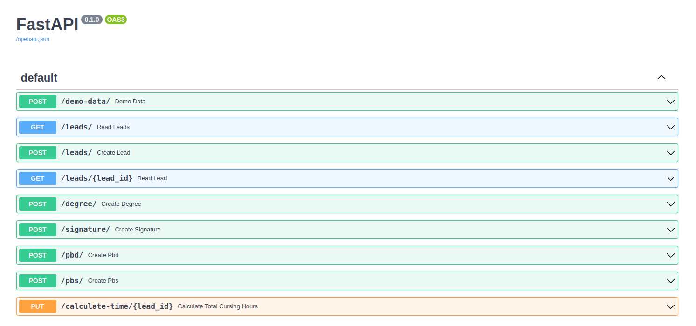
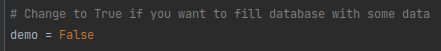
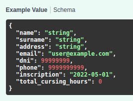
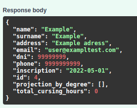
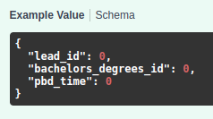
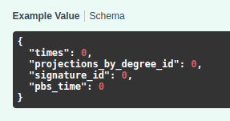

<h1>Lead Register</h1>

This a tiny app for register leads. The leads are students who need to be registered, each with the
subjects of each bachelor's degree in which they are enrolled.

<h2>EndPoints</h2>

<h3>/demo-data/</h3>

Demo data is the endpoint for fill your database if you will be preferred. Will be able this function
change demo value to set True in app/main.py

<h3>/leads/</h3>

You can register a lead without subjects and bachelor's degree in this endpoint with a post method.
Or you can get all leads with a get method.

If you want to get a single lead you can add the id after /leads/lead_id.

**Example Json Value for send via post**

**Example of what will you get**

<h3>/pbd/ & /pbs/</h3>

In those endpoints we will designate a projection of bachelor's degree to user. In /pbd/ we will be
create a relation between a leads and bachelor's degree, only pass both ids.

In /pbs/ will be load subjects for that bachelor's degree with the times that was course the subject.

<h3>/calculate-time/</h3>

In this PUT method we will calculate time in hours the leads pass in a bachelor's degree.

<h2>Installation</h2>

Requirements:
 1. Python 3.8
 2. Docker Compose

In a root repository run:
- docker-compose up